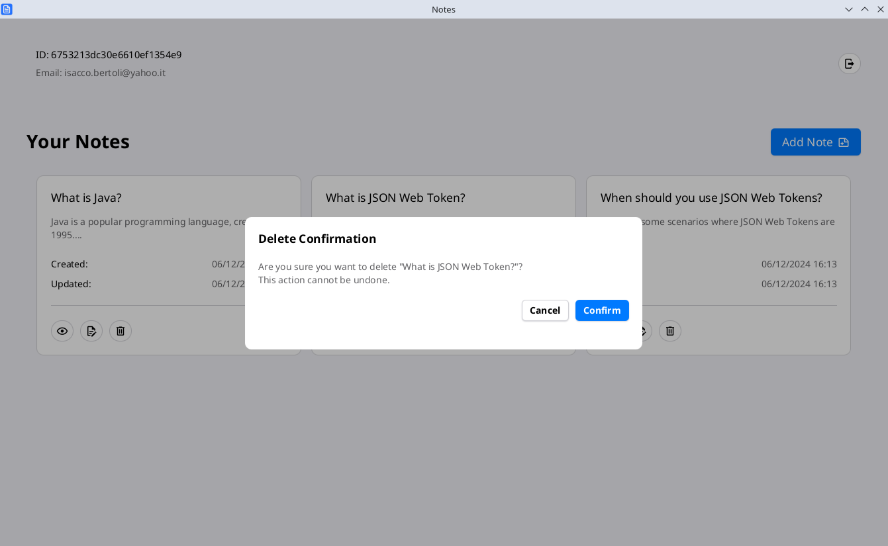

# java-notes-client

- Java Notes Client is a cross-platform desktop application built with JavaFX to provide a user-friendly interface for interacting with the Java Notes API. Featuring a modern design powered by Atlantafx UI, it allows users to seamlessly create, view, update, and delete personal notes. The application ensures a smooth user experience with responsive design and intuitive navigation.


## Features

- Mutiplatform support for Windows, Linux, and macOS.
- CRUD operations for notes.
- Organized and understandable app structure.
- Simple and easy to use UI and UX.
- Responsive design.


## Tech Stack Client

- JavaFX
- Atlantafx UI
- Retrofit2
- Materialdesign2 Icons


### Prerequisites
- **Java JDK 21**: This project requires Java version 21 or higher.


## Demo
- You can download the application from https://github.com/Isacco-B/java-notes/releases


### Images

<div style="display: flex; flex-direction: column; justify-content: space-between; gap: 10px; margin-bottom: 10px">
    
    
    
    
    
</div>


## Getting Up and Running Locally

- Clone this repository to your local machine:

```bash
git clone https://github.com/Isacco-B/java-notes.git
```

- Move to the client directory

```bash
cd client
```

Update the BASE_URL value in ./src/main/resources/application.properties

```bash
app.name=${app.name}
app.version=${project.version}

BASE_URL=http://localhost:7000/api
```

- Create and run the jar file:

```bash
mvn clean package
```
```bash
cd target
```
```bash
java -jar notes-client.jar
```

## 🔗 Links

[](https://www.linkedin.com/in/isacco-bertoli-10aa16252/)
