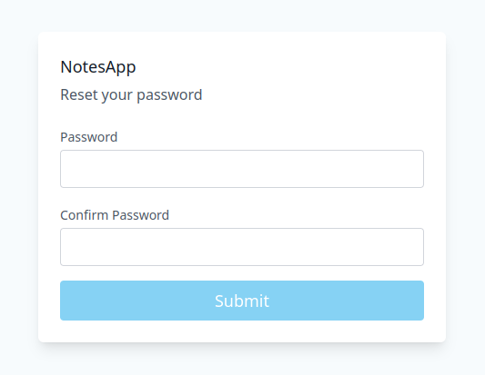
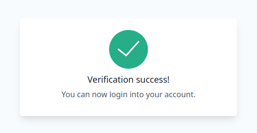

# java-notes-api

- Java Notes is a RESTful application designed to create, manage, and secure personal notes. The project leverages modern technologies such as Java, Javalin, and MongoDB, implementing JWT-based authentication and advanced security features like account verification and password reset via email.


## Features

- CRUD operations for notes.
- Implements JWT-based authentication and authorization.
- Implements request validation and middleware.
- Account verification.
- Password reset.
- Organized and understandable app structure.


## Tech Stack Server

- **Backend:** Java, Javalin, java-jwt, commons-email
- **Database:** MongoDB
- **Architecture:** RESTful JSON API


### Prerequisites

- **Java 17**: This project requires Java version 17 or higher.
- **Maven**: You need to have Maven installed to build and run the project.
- **MongoDB**: You need to have a running MongoDB instance to connect to.


## Demo

- You can use https://demo16.isaccobertoli.com/api as base_url to interact with the API.
- You can use https://github.com/Isacco-B/java-notes/tree/main/client as client to interact with the API.


## Images

<div style="display: flex; flex-direction: column; justify-content: space-between; gap: 10px; margin-bottom: 10px">
    
    
    
    
</div>


### API Endpoints

## Auth
| Method | Endpoint | Description | Parameters |
| --- | --- | --- | --- |
| POST | /api/auth/sign-up | Send email to verify account | email: string, password: string, confirmPassword: string |
| POST | /api/auth/sign-in | Returns JWT token | email: string, password: string |
| POST | /api/auth/reset-password/{email} | Send email to reset password | email: string |

## Notes | Requires Authorization Header with Bearer Token
| Method | Endpoint | Description | Parameters |
| --- | --- | --- | --- |
| GET | /api/notes | Returns all notes for the authenticated user. |
| GET | /api/notes/{noteId} | Returns a specific note for the authenticated user. | noteId: string |
| POST | /api/notes | Creates a new note for the authenticated user. | title: string, content: string |
| PUT | /api/courses/{noteId} | Updates a note for the authenticated user. |  title: string, content: string |
| DELETE | /api/courses/{noteId} | Deletes a note for the authenticated user. | noteId: string |

## User | Requires Authorization Header with Bearer Token
| Method | Endpoint | Description | Parameters |
| --- | --- | --- | --- |
| GET | /api/users/{userId} | Returns a specific user for the authenticated user. | userId: string |
| DELETE | /api/users/{userId} | Delete a specific user for the authenticated user. | userId: string |


## Getting Up and Running Locally

- Clone this repository to your local machine:

```bash
git clone https://github.com/Isacco-B/java-notes.git
```

- Move to the server directory

```bash
cd server
```

Rename the ./src/main/resources/.env.example file to ./src/main/resources/.env and update the values.

```bash
MODE=development | production

JWT_SECRET=1234

SERVER_PORT=7000
SERVER_URL=http://localhost

DB_HOST=mongodb://localhost:27017
DB_NAME=notes_app

EMAIL_ADDRESS=
EMAIL_HOST=
EMAIL_PASSWORD=
EMAIL_PORT=
```
If you set MODE=development, you don't need to specify EMAIL settings.
The verification end reset link will be printed on the console.

- Create and run the jar file:

```bash
mvn clean package
```
```bash
cd target
```
```bash
java -jar notes-server.jar
```

## 🔗 Links

[](https://www.linkedin.com/in/isacco-bertoli-10aa16252/)
